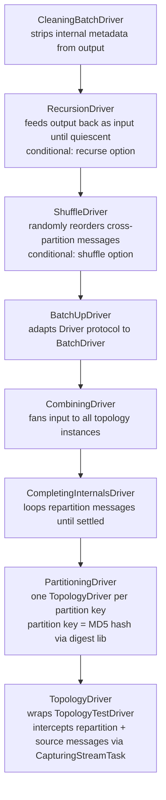
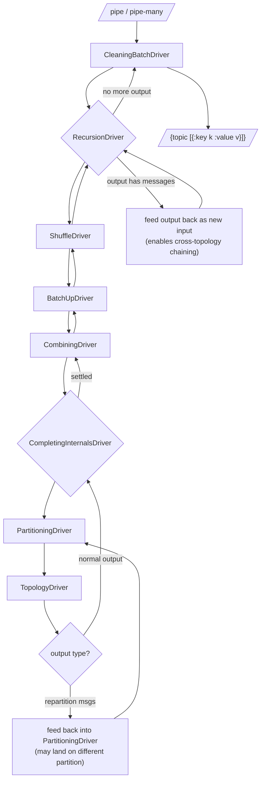

# ktest

Clojure library for unit-testing Kafka Streams topologies with partition-aware, deterministic execution. Wraps `TopologyTestDriver` with a layered driver stack that simulates multi-partition behaviour, repartitioning, and optional message shuffling.

## Build and Test

Java classes in `src-java/` **must** be compiled before any Clojure code can load:

```sh
clj -M:build                                    # compile Java classes (required before REPL or tests)
clj -M:test:run-tests                            # run all tests
clj -M:test:run-tests -v ktest.core-test/simple  # run a single test
./test.sh                                        # compile Java + run tests (standard workflow)
```

Any change to Java sources in `src-java/` requires `clj -M:build` and a REPL restart.

### Aliases

`:test` provides test classpath (paths + deps) without a runner. `:run-tests` provides the runner main-opts. They compose freely with `:nREPL`:

| What | Command |
|---|---|
| Run tests | `clj -M:test:run-tests` |
| Single test | `clj -M:test:run-tests -v ns/test` |
| REPL + test classpath | `clj -M:test:nREPL` |
| REPL (no tests) | `clj -M:nREPL` |
| Build Java | `clj -M:build` |

### Protocol reload

The `Driver` protocol and its record implementations span multiple namespaces. Reloading a single driver namespace (e.g. `topology-driver`) without reloading the protocol causes `ClassCastException` due to classloader mismatch. Reload the full chain:

```clojure
(require '[ktest.protocols.driver :refer :all] :reload
         '[ktest.drivers.topology-driver] :reload
         '[ktest.drivers.completing-internals-driver] :reload
         '[ktest.drivers.combined-driver] :reload
         '[ktest.drivers.partitioned-driver] :reload
         '[ktest.core] :reload)
```

## Formatting and Linting

- `cljstyle` (config: `.cljstyle`); `:list-indent 1`
- `clj-kondo`
- Versions pinned in `.tool-versions` (asdf)

## Release Workflow

- `install.sh $VERSION`: updates pom version, compiles Java, builds jar via depstar, installs to local Maven
- `deploy.sh $VERSION`: runs `install.sh`, tags the commit, pushes tags, deploys jar to Clojars
- `pom.xml` is generated/updated by `clj -Spom`; don't edit manually except via `mvn versions:set`

## Architecture

### Public API

`ktest.core` is the only public namespace. Everything else is internal. Key functions:
- `driver` creates a `BatchDriver` from an options map and a `{name topology-supplier-fn}` map
- `pipe` / `pipe-many` send messages; return `{topic-name [{:key k :value v}]}`
- `advance-time` / `set-time` control wall-clock for punctuators
- `stores-info` reads current state store contents

### Driver Stack

Assembled in `ktest.driver/default-driver`. Each layer wraps the one below, adding one concern:



Two protocols:
- `ktest.protocols.driver/Driver`: single-message `pipe-input`
- `ktest.protocols.batch-driver/BatchDriver`: batch `pipe-inputs`

### Message Flow

Shows how input messages are processed and how the two feedback loops operate:



### Java Interop Layer

`src-java/` contains classes placed in Kafka's own packages to access package-private internals:
- `CapturingStreamTask`: wraps `StreamTask`, intercepts `addRecords` via a Clojure `IFn` delegate
- `TopologyInternalsAccessor`, `ProcessorTopologyAccessor`, `StoreAccessor`, `MaterializedStoreFactoryAccessor`: public accessors for internal fields

These are **tightly coupled to the Kafka Streams version** in `deps.edn`. Upgrading Kafka will likely require updating them.

## Key Conventions

- Topology suppliers can return a `Topology` or a `{:topology t :config m}` map for custom Kafka config
- Options map (`ktest.config/mk-opts`) flows through the entire stack; key options:
  - `:key-serde` / `:value-serde`: serialisation (required)
  - `:partition`: fn controlling mock partition assignment (default: serde round-trip of key)
  - `:shuffle` / `:seed`: enable deterministic random reordering across partitions
  - `:recurse` / `:recursion-limit` (default 1000): feed output back as input until quiescent
  - `:topo-mutator`: hook to transform topology before test; default swaps stores to in-memory and shares global stores across partitions
  - `:initial-ms`: starting wall-clock epoch (default 0)
- Kafka message headers are captured as Clojure metadata (`:kafka-headers`) on output values
- Tests use `with-open` on the driver (protocols include `close`)
- `ktest.test-utils` (in `test/`, not published) provides Clojure wrappers around Kafka Streams builder API for constructing test topologies
- `deps.edn` requires the Confluent Maven repo (`packages.confluent.io`) for Kafka dependencies
